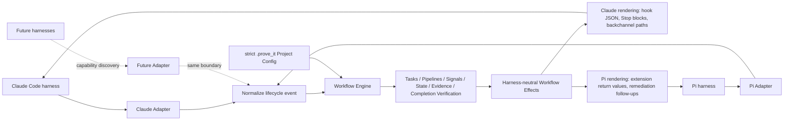

# prove_it architecture visualizer

<!-- Generated by `bun tools/visualizer/generate.js`. Do not edit by hand. -->

prove_it is a methodology/workflow engine. Harnesses such as Claude Code and Pi connect through adapters that normalize harness-native events into shared Workflow Engine stages, then render Workflow Engine effects back to each harness.

## Audience

- contributors
- adapter authors
- technical stakeholders

## Source of truth

This view is intentionally source-driven. It is generated from repository metadata rather than hand-maintained diagram text.

- adapter capability declarations
- clean runtime workflow stages
- adapter-owned effect rendering boundaries

## Architecture flow

## Walkthrough

### Harnesses

Agent runtimes expose different native hooks, events, tools, state, and completion semantics.

Examples: Claude Code, Pi, future adapters.

### Adapters

Adapters translate harness-native inputs into normalized lifecycle events and translate Workflow Engine effects back into harness-native protocol responses.

Examples: Claude Adapter, Pi Adapter.

### Normalized lifecycle events

Shared event shape used by the Workflow Engine regardless of which harness emitted the original event.

Examples: session_start, pre_tool, post_tool, post_tool_failure, agent_end, pre_commit, pre_push.

### Workflow Engine

The shared core evaluates strict project config and emits harness-neutral effects.

Examples: Project Config, Tasks, Pipelines, Signals, Session State, Evidence, Completion Verification.

### Workflow effects

Harness-neutral outcomes produced by shared workflow evaluation.

Examples: allow, block, approve, remediation, context injection, env update.

### Adapter-specific rendering

Adapters own protocol details so shared workflow behavior does not become harness-specific.

Examples: Claude hook JSON, Pi extension return values, Pi follow-up remediation messages.

## Shared Workflow Engine responsibilities

- strict Project Config evaluation
- Task and Pipeline selection
- Signal lifecycle semantics
- phase and session-control semantics
- Completion Verification decisions
- Evidence and observation facts
- harness-neutral Workflow Effects

## Adapter-owned responsibilities

- harness-native activation artifacts
- event and hook normalization
- session state storage integration
- tool and file-path extraction details
- reviewer provider integration where supported
- backchannel mechanics where supported
- protocol-specific effect rendering

## Adapter capability matrix

| Capability | Claude | Pi |
| --- | --- | --- |
| pre-tool blocking | hard block via PreToolUse | hard block via tool_call |
| post-tool observation | observe-only via PostToolUse | observe-only via tool_result |
| prompt injection | available via SessionStart | available via before_agent_start |
| model-callable tools | unsupported | available |
| session state | available | available |
| completion verification | hard block via Stop | remediation after turn_end |

## Capability diagnostics

### Claude

- **pre-tool blocking**: hard block via PreToolUse
  - Claude PreToolUse supports hard pre-tool blocking.
- **post-tool observation**: observe-only via PostToolUse
  - Claude post-tool hooks observe completed tool calls without changing the completed tool result.
- **prompt injection**: available via SessionStart
  - Claude SessionStart can inject prove_it guidance into the active session.
- **session state**: available
  - Claude uses adapter-owned filesystem-backed Session State.
- **completion verification**: hard block via Stop
  - Claude Stop supports hard completion blocking.

### Pi

- **pre-tool blocking**: hard block via tool_call
  - Pi tool_call supports hard pre-tool blocking.
- **post-tool observation**: observe-only via tool_result
  - Pi post-tool hooks observe tool outcomes without blocking completed tool calls.
- **prompt injection**: available via before_agent_start
  - Pi can inject prove_it guidance before the agent starts.
- **model-callable tools**: available
  - Pi exposes model-callable tools for in-session prove_it actions.
- **session state**: available
  - Pi exposes session state for adapter workflows.
- **completion verification**: remediation after turn_end
  - Pi cannot hard-block completion; prove_it prompts remediation from turn_end and preserves agent_end settlement.

## Not implemented as adapters

- **Codex**: not implemented. Codex is documented as capability discovery only; it is not currently implemented as a prove_it adapter.

## Design intent

The architectural boundary is: harnesses are replaceable, adapters are translation layers, and the Workflow Engine owns shared prove_it behavior. Adapter differences are represented as capabilities rather than hidden conditionals in product language.
